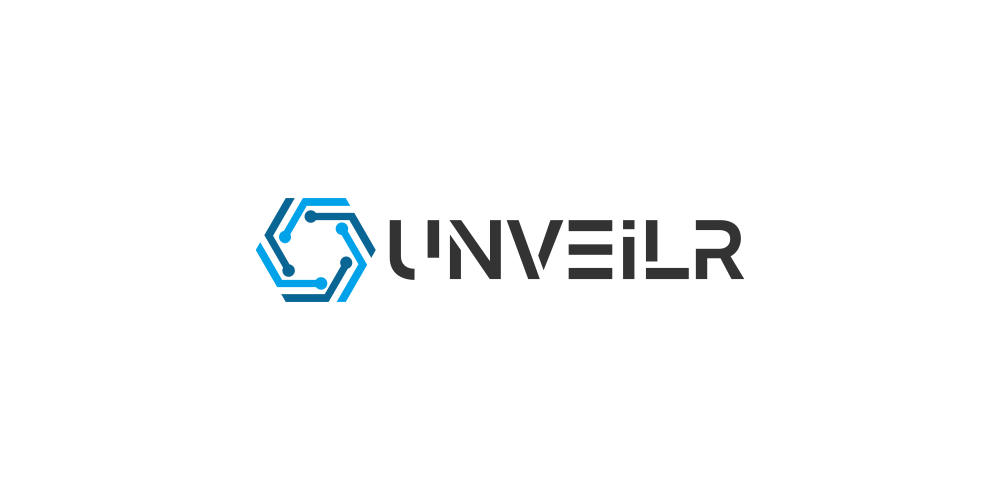

<br>
[][repo]
[][repo]
[][repo]
[][repo]
[][repo]
[][npm]
[][npm]
[][npm]
[][release]
[][release]
[][repo]

## ！！！声明！！！

**本程序仅供于学习交流，请使用者遵守《中华人民共和国网络安全法》，勿将此工具用于非授权的测试，开发者不负任何连带法律责任。**

### :loud_sound:公告 
- :rocket:[v2.0.0-beta.1](https://github.com/r3x5ur/unveilr/releases/tag/)已经发布，快来试试吧~
- 一些常见问题移到[讨论区](https://github.com/r3x5ur/unveilr/discussions)去了

### ✨新版本特性

- 🔥支持自动解密(`windows`从路径上提取`wxAppId`)
- 🔥自动合并子包
- 🔥支持解析最新版`wxapkg` (`APP_V3`/`APP_V4`/`APP_SUBPACKAGE_V2`)
- 🔥支持解析最新版小程序插件 (`APP_PLUGIN_V1`)
- 🔥采用`@babel/core`直接解析语法树，精准提取源码(`1.x`是正则提取)
- 🔥使用`Threadjs`做的线程池，`cpu`直接干到顶(🤡解析语法树特别吃`cpu`)

### ✅安装方法

#### 1. 下载可执行文件

- 从[下载地址][release]下载对应操作系统的可执行文件
- 运行 `unveilr@[version]-[platform]-[arch][.exe] --help`

#### 2. npm 安装

```bash
# npm
npm i unveilr -g
# yarn
yarn global add unveilr

unveilr --help
# 简称
uvr -h
# 当 'unveilr' 不是内部或外部命令，也不是可运行的程序或批处理文件。
# 尝试在命令前面加一个 npx, 例如：
npx unveilr --help
```

### 📝参数详解

- 子命令是为了后续集成别的平台小程序解包功能 **([其他小程序反编译方案收集](https://github.com/r3x5ur/unveilr/discussions/24))**
- 子命令默认为 `wx`

| 子命令      | 参数                        | 解释                                             |
|----------|---------------------------|------------------------------------------------|
| `global` | `-l, --log-level <level>` | 设置日志等级 `debug`，`info`，`warn`，`error` 默认 `info` |
| `wx`     | `<packages...>`           | `wxapkg`的路径，可以是多个，也可以是一个目录                     |
| `wx`     | `-i, --appid <appid>`     | 解密`windows`上的 `wxapkg`时需要提供**🔥已经支持自动从路径中提取**  |
| `wx`     | `-f, --format`            | 是否需要格式化解析出来的代码                                 |
| `wx`     | `--no-clear-decompile`    | 不清除反编译时的残留文件                                   |
| `wx`     | `--no-clear-save`         | 不清除之前的编译结果                                     |
| `wx`     | `--no-parse`              | 只提取`wxapkg`中的文件，不进行反编译                         |
| `wx`     | `-d, --depth <depth>`     | 设置从目录中查找`wxapkg`的深度默认: `1` 设置为`0`时不限制深度        |
| `wx`     | ` -o, --output <path>`    | 设置反编译输出路径                                      |

### 💡使用示例

```bash
# 直接解包整个目录
$ unveilr /path/to/wxapkg/dir/
# 解包多个包
$ unveilr /path/to/1.wxapkg /path/to/2.wxapkg ...
# 指定子命令并指定微信AppId
$ unveilr wx /path/to/wxapkg/dir/ -i wx11aa22bb33cc44dd
# 格式化解析出来的代码
$ unveilr wx /path/to/wxapkg/dir/ -f
# 只提取源文件不解析进行反编译
$ unveilr wx /path/to/wxapkg/dir/ --no-parse
```

#### 旧版本可以使用 [1.0.2版本](https://github.com/r3x5ur/unveilr/releases/tag/v1.0.2)

### [:bulb:提交问题](https://github.com/r3x5ur/wxapkg-unpacker/issues)

### [:triangular_flag_on_post:社区讨论](https://github.com/r3x5ur/unveilr/discussions)

### [:memo:更改日志](https://github.com/r3x5ur/wxapkg-unpacker/blob/master/CHANGELOG.md)

### [:money_with_wings:赞助(开源不易，感谢支持)](https://github.com/r3x5ur/wxapkg-unpacker/blob/master/CONTRIBUTING.md)

### 💬其他说明

- 本程序现在使用的开源协议是 [GPL-3.0](https://www.gnu.org/licenses/gpl-3.0.html)

### 🍻特别感谢

- [wxappUnpacker](https://github.com/qwerty472123/wxappUnpacker)
- [pc_wxapkg_decrypt](https://github.com/BlackTrace/pc_wxapkg_decrypt)
- [mac_wxapkg_decrypt](https://github.com/TinyNiko/mac_wxapkg_decrypt)

[repo]:https://github.com/r3x5ur/unveilr

[npm]:https://www.npmjs.com/package/unveilr

[release]:https://github.com/r3x5ur/unveilr/releases
