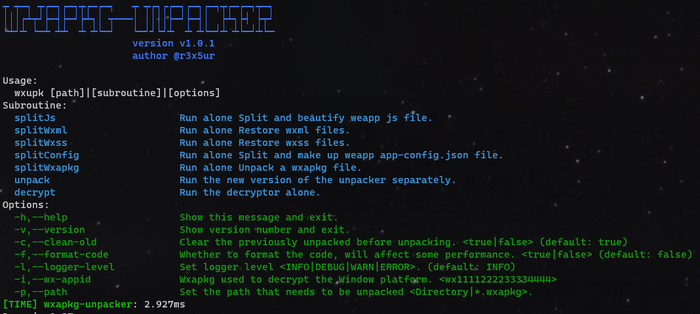
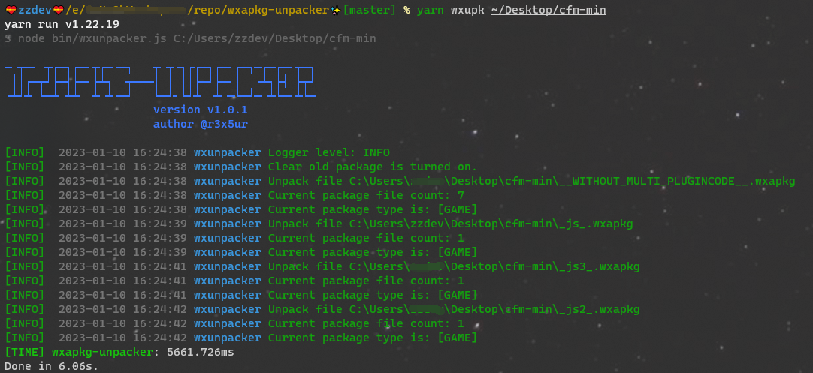

# wxapkg-unpacker
## NOTE: [wxappUnpacker](https://github.com/qwerty472123/wxappUnpacker) 版本底层有一些bug没法解决，正在使用 ts 重构中~ 预计 3月底发布 2.0 版本

[](https://www.npmjs.com/package/wxapkg-unpacker)
[](https://www.npmjs.com/package/wxapkg-unpacker)
[](https://github.com/r3x5ur/wxapkg-unpacker)
[](https://github.com/r3x5ur/wxapkg-unpacker)
## wxapkg-unpacker 是什么？

> 自动化反编译微信小程序/小游戏，小程序安全利器
> 基于 [wxappUnpacker](https://github.com/qwerty472123/wxappUnpacker) 二次开发
## :sparkles:特性
### 1. 针对微信小游戏的优化
- 微信小游戏一键解包整个项目
- 重新格式化代码
- 将所有子包合并到一个目录中
- 删除多余的无效代码
- 直接生成配置文件
- 可直接导入微信开发工具运行
### 2. 针对微信小程序的优化
- 重新格式化代码
- 删除多余的无效代码
### 3. 加入脚手架
- 支持单独使用所有子模块
### 4. 加入解密模块
- 可一键解密Window平台下的小程序包

## :sparkles:安装和使用
### 1. 安装
```bash
# you can use npm install
npm i wxapkg-unpacker -g
# or yarn add
yarn global add wxapkg-unpacker # Recommend
# or clone this repository
git clone https://github.com/r3x5ur/wxapkg-unpacker.git
cd wxapkg-unpacker
yarn install
```
### 2. 使用
- 命令全称：**wxunpacker**
- 一般使用别名：**wxupk**
1. 全局安装的
```bash
wxupk --help
# 或者
npx wxupk --help
```
2. 克隆仓库的
```bash
yarn wxupk --help
# 或者
npm run wxupk --help
```
3. 解包从安卓手机获取的wxapkg
```bash
# 解包并格式化代码
wxupk /path/to/wxapkg/dir/ -f
```
4. 解包被加密的wxapkg, 一般是从Windows获取的 (需要提供[wxAppid](https://zhidao.baidu.com/question/712051619583432605.html))
```bash
wxupk /path/to/wxapkg/dir/ -i wx1111222233334444
```
5. 子程序都是单独的模块, 可以单独调用
```bash
# 子程序参数参考输出提示
wxupk decrypt
```
## :sparkles:屏幕截图





## :sparkles:提交问题
[ISSUES](https://github.com/r3x5ur/wxapkg-unpacker/issues)
## :sparkles:更改日志
[CHANGELOG](https://github.com/r3x5ur/wxapkg-unpacker/blob/master/CHANGELOG.md)
## :sparkles:赞助
[CONTRIBUTING](https://github.com/r3x5ur/wxapkg-unpacker/blob/master/CONTRIBUTING.md)

